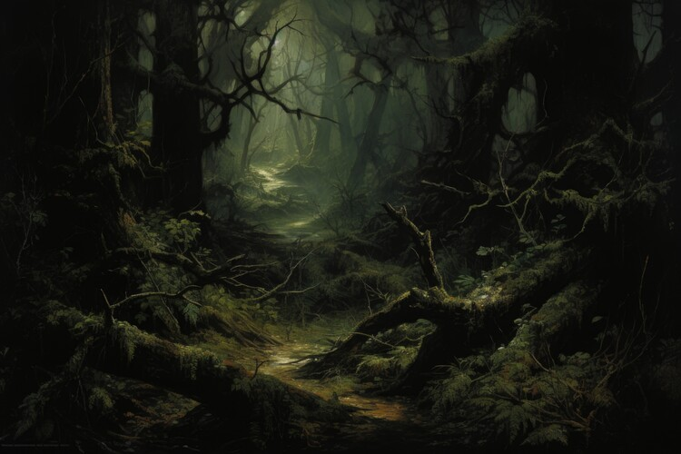
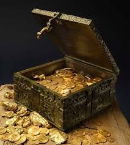

# Quest for the Lost Treasure Game

Welcome to **Quest for the Lost Treasure**, an interactive adventure game where your decisions determine your fate as you search for the legendary Lost Treasure of Eldoria.

This game is designed to provide a text-based adventure where you make crucial decisions in various scenarios, such as navigating through the Dark Forest, climbing the Mountain Path, and more. Your goal is to explore, fight boars, solve mysteries, and find treasure!

## Demo

You can play the game directly on Replit by clicking the link below:

[**Play Quest for the Lost Treasure**](https://4cb718a3-1a8f-4481-93cc-d206846860e3-00-2xpboou4wqql0.pike.replit.dev)

## How to Play

1. **Start the Game:** Upon visiting the link, you’ll be greeted with an introduction to the game.
2. **Make Choices:** The game will prompt you to make decisions at different stages of your adventure. Choose wisely!
3. **Explore:** Your decisions will take you down different paths, like the Dark Forest, Mountain Path, or even hidden caves with dragons.
4. **Goal:** Your ultimate goal is to find the **Lost Treasure of Eldoria** by solving puzzles and making the right choices.

## Features

- **Text-based Adventure:** Navigate through interactive paths with text prompts and choose your responses.
- **Unique Scenarios:** Battle wild boars, investigate glowing objects, and sneak past dragons to uncover the treasure.
- **Multiple Outcomes:** Depending on your choices, the story may end in a victory, defeat, or discovery.

## Screenshots

- **Town Square:**
    

- **Dark Forest Encounter:**
    

- **Mountain Path:**
    

- **Treasure Found:**
    

## Contributing

If you would like to contribute to this project, feel free to open a pull request! Suggestions, bug fixes, and new features are always welcome.

